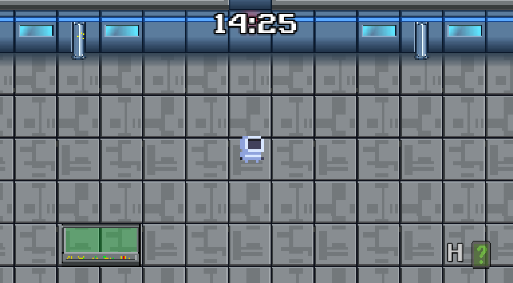
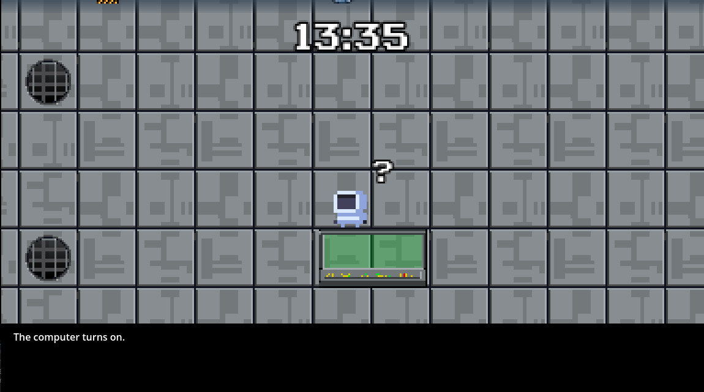
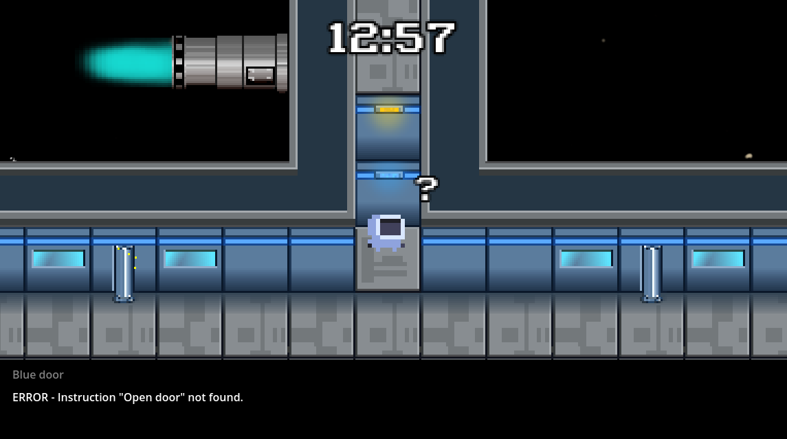

# Space Escape: AI Lockdown  

Space Escape: AI Lockdown is an escape room-style puzzle game created in Godot. This game is designed for completion of my MSc computer science project to assess soft skills development.  

## Story  

You are a space engineer aboard the USS Galactica, a patrol spaceship from Earth that monitors the solar system for extraterrestrial threats. While performing routine maintenance on the lower decks, the ship goes into full security lockdown. A rogue AI named 'CatGPT' has taken control of all systems, and threatens to eject the entire crew into deep space! Will you be able to restore order to the ship's systems in time? Or will you meet your end in the cold vacuum of space?  

## Installation  

You can play the web version at itch.io (link coming soon)  
Download the latest version for your system from the [releases](https://github.com/corndogit/space-escape/releases/latest) page.

## Screenshots  

  
  

## Development  
Clone the repository and open the project file in the Godot editor (v4.0.2-stable).
